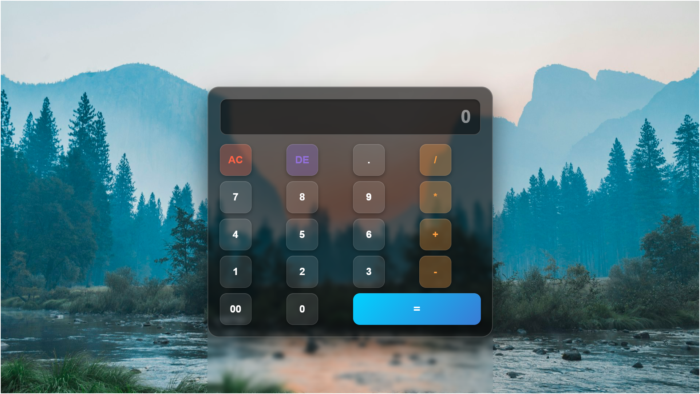

# 🧮 Calculator

<p align="center">
  
</p>

<p align="center">
  <a href="#"></a>
  <a href="#"></a>
  <a href="#"></a>
  <a href="#"></a>
</p>

<p align="center">
  <b>A beautiful, fully functional calculator with keyboard support and repeat calculation feature</b>
</p>

---

## ✨ Features

| Feature | Description |
|---------|-------------|
| 🎨 **Modern UI** | Clean, responsive design with smooth interactions |
| ⌨️ **Keyboard Support** | Use your keyboard for lightning-fast calculations |
| 🔄 **Repeat Calculation** | Press `Enter` or `=` to repeat the last operation |
| ⚠️ **Error Handling** | User-friendly error messages for invalid inputs |
| 📱 **Responsive** | Works on desktop and mobile devices |
| 🎯 **Smart Input** | Auto-replaces operators, max 15 digit limit |

---

## 🚀 Getting Started

### Prerequisites
- Node.js (v16 or higher)
- npm or yarn

### Installation

```bash
# Clone the repository
git clone <repository-url>
cd Calculator

# Install dependencies
npm install

# Start development server
npm run dev
```

### Build for Production

```bash
npm run build
```

---

## 🎮 Keyboard Shortcuts

| Key | Action |
|-----|--------|
| `0-9` | Input numbers |
| `+` `-` `*` `/` | Operators |
| `.` | Decimal point |
| `Enter` or `=` | Calculate / Repeat last operation |
| `Backspace` or `Delete` | Delete last character |
| `Escape` | Clear all (AC) |

---

## 🏗️ Project Structure

```
Calculator/
├── 📁 public/
│   ├── calculator-icon-31.png    # App icon
│   └── vite.svg                  # Vite logo
├── 📁 src/
│   ├── 📁 assets/
│   │   └── react.svg             # React logo
│   ├── 📁 componet/
│   │   ├── calculator.jsx        # Main calculator component
│   │   └── Calculator.css        # Component styles
│   ├── App.css                   # App styles
│   ├── App.jsx                   # Root component
│   ├── index.css                 # Global styles
│   └── main.jsx                  # Entry point
├── 📁 img/
│   └── Calculator.png            # Screenshot
├── index.html                    # HTML template
├── package.json                  # Dependencies
└── vite.config.js                # Vite config
```

---

## 🛠️ Tech Stack

- **React 18.3.1** - UI library
- **Vite 5.4.10** - Build tool & dev server
- **ESLint** - Code linting
- **CSS3** - Styling with custom properties

---

## 📜 Available Scripts

| Script | Description |
|--------|-------------|
| `npm run dev` | Start development server |
| `npm run build` | Create production build |
| `npm run lint` | Run ESLint |
| `npm run preview` | Preview production build |

---

<p align="center">
  Made with ❤️ using React + Vite
</p>
